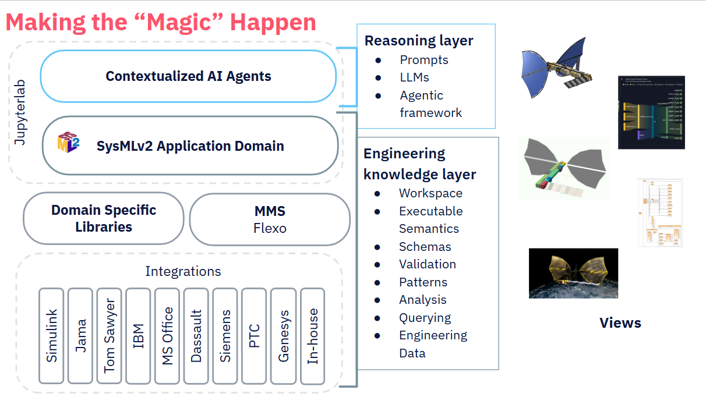
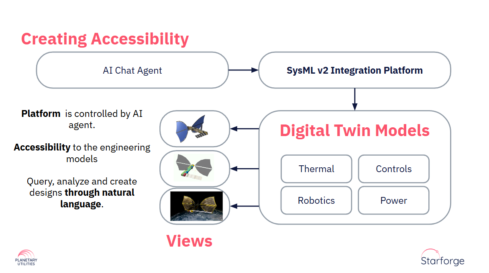

# Starforge

**Starforge** is an **AI-native engineering workspace platform** for **model-based systems engineering and digital twin development**.

The platform integrates:

* **SysML v2 modeling**
* **AI engineering agents**
* **multi-domain digital twins**
* **engineering analysis tools**
* **collaborative model management**

Starforge connects engineering models, analysis tools, and AI agents into a unified **engineering knowledge environment**.

The platform can run either:

* as a **multi-user server platform on Kubernetes**, or
* as a **local engineering workstation environment**.

---

# Platform Concept

Starforge builds on the **Dragon architecture**, which organizes engineering artifacts into a pipeline of digital twins evolving from early concept to engineering implementation. This approach eliminates tool silos and ensures traceability across the lifecycle .

The platform layers include:

* **AI reasoning layer** — prompts, LLMs, and agentic orchestration
* **SysML v2 integration platform** — formal system model backbone
* **engineering knowledge layer** — schemas, validation, analysis, and data
* **digital twin views** — multi-domain representations of the system

---

# Architecture Overview

## Starforge Platform Layers

Starforge combines **AI reasoning with engineering models**.

Major layers include:

### AI Engineering Copilot

Engineers interact with the system through **AI agents** capable of:

* generating SysML v2 models
* querying engineering data
* orchestrating simulations
* generating stakeholder views

The AI copilot acts as a **conversational interface to the digital twin**.

---

### SysML v2 Backbone

SysML v2 provides the **formal system model foundation**:

* structure and behavior modeling
* formal semantics
* repository-based model management
* API-driven integration

The SysML v2 backbone ensures **consistent system representation across engineering domains** .

---

### Engineering Knowledge Layer

The platform captures engineering knowledge in:

* executable semantics
* domain schemas
* validation rules
* analysis pipelines
* engineering data models

This layer ensures that engineering models remain **consistent and traceable** across tools.

---

### Digital Twin Integration

Starforge integrates **multi-domain digital twins**, including:

* thermal models
* control systems
* robotics
* power systems
* CAD and geometry

The system generates **multiple synchronized engineering views** derived from the underlying model.

---

# Conversational Digital Twin

Engineers interact with digital twins through natural language.

Example workflow:

1. Engineer describes a design using natural language
2. AI agents generate or modify SysML v2 models
3. Digital twin models update automatically
4. Engineering views are generated across domains

This approach allows engineers to **design, analyze, and query systems through natural language interfaces** while maintaining formal models.

---

# Editions

Starforge is available in **four editions**.

## Deployment environments

**Server Editions**

* multi-user engineering platform
* Kubernetes deployment
* scalable collaboration

**Desktop Editions**

* local engineering workstation
* Docker Compose environment
* integration with desktop tools

## Feature tiers

**Standard**

Core modeling and AI capabilities.

**Premium**

Advanced visualization, digital twin integration, and enterprise integrations.

---

# Key Capabilities

### SysML v2 Modeling Platform

* SysML v2 textual modeling
* model validation and evaluation
* API-driven model access
* visual diff and model baselining
* distributed model management

---

### AI Engineering Agents

Starforge includes an extensible **agentic framework** supporting:

* SysML v2 authoring agents
* OOSEM engineering assistants
* requirements engineering agents
* simulation orchestration agents
* customizable domain agents

Agents can generate models, run analyses, and synthesize engineering views.

---

### Digital Twin Engineering

The platform supports **multi-domain digital twins** including:

* CAD models
* thermal analysis
* robotics simulations
* orbital simulations
* immersive visualization

These twins remain **synchronized through the SysML v2 model backbone**.

---

### Engineering Tool Integrations

Starforge integrates with major engineering tools, including:

* Simulink
* Excel
* Onshape
* Sedaro
* Jama
* Omniverse
* Paraview

The platform provides a **unified engineering workspace across tool ecosystems**.

[Starforge editions and features](https://github.com/planetaryutilities/starforge-public/wiki/Starforge-Editions-and-features)

---

# Collaboration via Flexo Model Management

Starforge uses the **OpenMBEE Flexo Model Management System (MMS)** for collaborative model development.

Flexo provides **Git-like version control for engineering models**.

Typical workflow:

1. Engineers **clone** models from a Flexo repository
2. Work locally in desktop or server environments
3. **Commit** changes
4. **Push** updates
5. Other engineers **pull** updates

This enables collaboration between:

* desktop engineering environments
* server-based Starforge deployments
* distributed engineering teams

---

# Documentation

User documentation is available in the **GitHub Wiki**.

The wiki includes:

* platform overview
* feature documentation
* engineering workflows
* AI assistant usage

Documentation:

[Starforge Wiki](https://github.com/planetaryutilities/starforge-public/wiki)

---

# Examples
The examples folder contains example notebooks and SysML models.

---

# Licensing

Starforge is **commercial software**.

Use of this software requires a valid license.
For licensing or evaluation access, please contact [Planetary Utilities](https://www.planetaryutilities.com).

